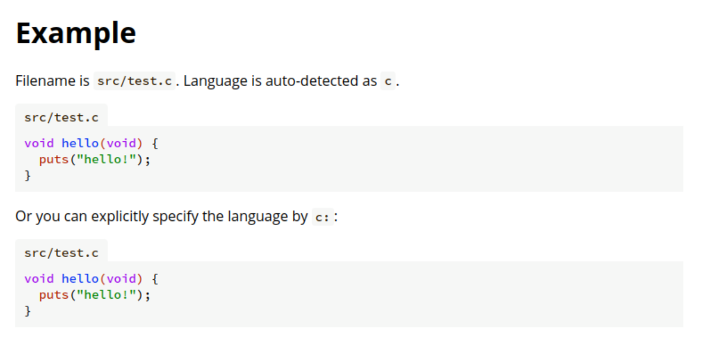

# mdbook-codename

mdbook-codename is a [mdBook](https://github.com/rust-lang/mdBook) preprocessor
to show a filename of the Markdown codeblock.

When you write a filename of the codeblock, the filename is shown above the codeblock.

````markdown
```src/test.c
void hello(void) {
  puts("hello!");
}
```

```c:src/test.c
void hello(void) {
  puts("hello!");
}
```
````



## Usage

Add the following to your `book.toml`:

```toml
[preprocessor.codename]
```

## Example

To show the example, run the following command:

```sh
mdbook serve --open
```
